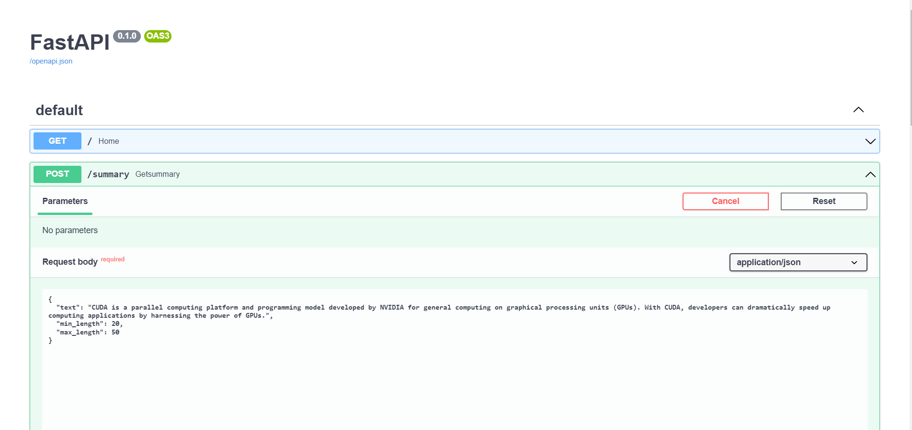
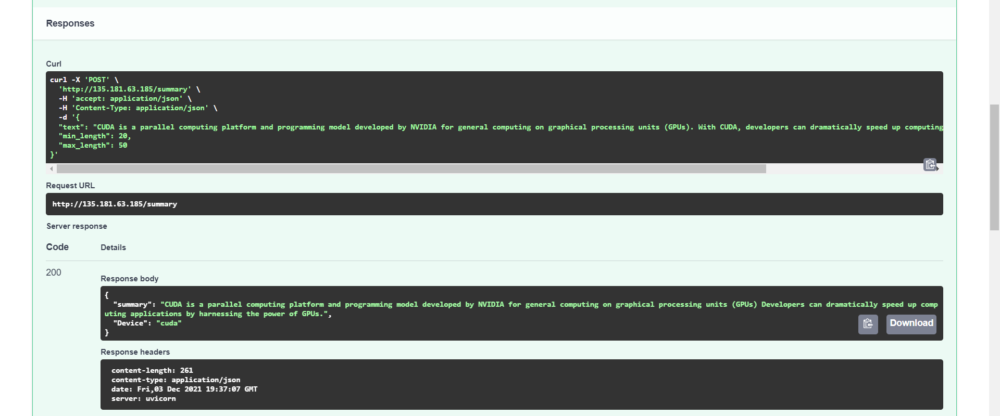

# GPU Docker NLP Application Deployment

Deploying a Text Summarization NLP use case on Docker Container Utilizing Nvidia GPU, to setup the enviroment on linux machine follow up the below process, make sure you should have a good configuration system, my system specs are listed below(I am utilizing DataCrunch Servers) :

* GPU : 2xV100.10V
* Image : Ubuntu 20.04 + CUDA 11.1

## Some Insights/Explorations
If you're a proper linux user make sure to setup it [CUDA](https://docs.nvidia.com/cuda/cuda-installation-guide-linux/index.html), [cudaNN](https://developer.nvidia.com/cudnn) and [Cuda Toolkit](https://developer.nvidia.com/cuda-toolkit)

If you're a WSL2 user then you will face a lot of difficulty in accelarating GPU of host system on WSL, as it has some unknown bugs which are needed to be fixed by them.

After setting up the CUDA and cudaNN, now we need to setup the CUDA Toolkit so that we can leverage GPU in Docker Container:

Follow up these commands:

1. **Install Docker:**

 ```shell
curl -fsSL https://download.docker.com/linux/ubuntu/gpg | sudo apt-key add -
sudo add-apt-repository \
   "deb [arch=amd64] https://download.docker.com/linux/ubuntu \
   $(lsb_release -cs) stable"
sudo apt-get update
sudo apt-get install docker-ce docker-ce-cli containerd.io
```

2. **Add your user to the docker group:**

 ```shell
sudo usermod -aG docker $USER
```

**Note:** ***You need to start a new session to update the groups.***

3. **Setup NVIDIA driver and runtime**

Verify the installation with the command `nvidia-smi`. You will see following output:
 ```
+-----------------------------------------------------------------------------+
| NVIDIA-SMI 470.57.02    Driver Version: 470.57.02    CUDA Version: 11.4     |
|-------------------------------+----------------------+----------------------+
| GPU  Name        Persistence-M| Bus-Id        Disp.A | Volatile Uncorr. ECC |
| Fan  Temp  Perf  Pwr:Usage/Cap|         Memory-Usage | GPU-Util  Compute M. |
|                               |                      |               MIG M. |
|===============================+======================+======================|
|   0  Tesla V100-SXM2...  On   | 00000000:03:00.0 Off |                  Off |
| N/A   38C    P0    52W / 300W |   2576MiB / 16160MiB |      0%      Default |
|                               |                      |                  N/A |
+-------------------------------+----------------------+----------------------+
|   1  Tesla V100-SXM2...  On   | 00000000:04:00.0 Off |                  Off |
| N/A   37C    P0    39W / 300W |      3MiB / 16160MiB |      0%      Default |
|                               |                      |                  N/A |
+-------------------------------+----------------------+----------------------+

+-----------------------------------------------------------------------------+
| Processes:                                                                  |
|  GPU   GI   CI        PID   Type   Process name                  GPU Memory |
|        ID   ID                                                   Usage      |
|=============================================================================|
|    0   N/A  N/A     23988      C   /usr/bin/python3                 2573MiB |
+-----------------------------------------------------------------------------+
```

4. **Install NVIDIA container runtime:**
 ```shell
curl -s -L https://nvidia.github.io/nvidia-container-runtime/gpgkey | sudo apt-key add -
distribution=$(. /etc/os-release;echo $ID$VERSION_ID)
curl -s -L https://nvidia.github.io/nvidia-container-runtime/$distribution/nvidia-container-runtime.list |\
    sudo tee /etc/apt/sources.list.d/nvidia-container-runtime.list
sudo apt-get update
sudo apt-get install nvidia-container-runtime
```

5. Restart Docker:
```shell
sudo systemctl stop docker
sudo systemctl start docker
```

Now you are ready to run your first CUDA application in Docker!

6. Run CUDA in Docker

Choose the right base image (tag will be in form of {version}-cudnn*-{devel|runtime}) for your application.
 ```shell
docker run --gpus all nvidia/cuda:11.4.2-cudnn8-runtime-ubuntu20.04 nvidia-smi
```
## How to run the application:

* Clone this repository `git clone https://github.com/DARK-art108/Summarization-on-Docker-Nvidia.git`
* Then build the Dockerfile: `docker build -t summarization .`
* Then run the Docker Image:  `docker run -p 80:80 --gpus all summarization`

Now in the Application their are two endpoint's `"/"` and `"/summary"` 

1. `/` is a default end point
2. `/summary` is a end point which perform text summarization

To test the application go to `http://0.0.0.0:80/docs` or `<public_ip>/docs`

***You can even use postman for this :)*** 

**API Setting is :**

| Parameters      | Setting |
| ----------- | ----------- |
| Request      | Post     |
| Body   | raw |
| Data Format | Json |
| Endpoint   | /summary        |





